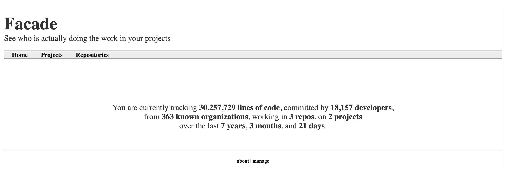
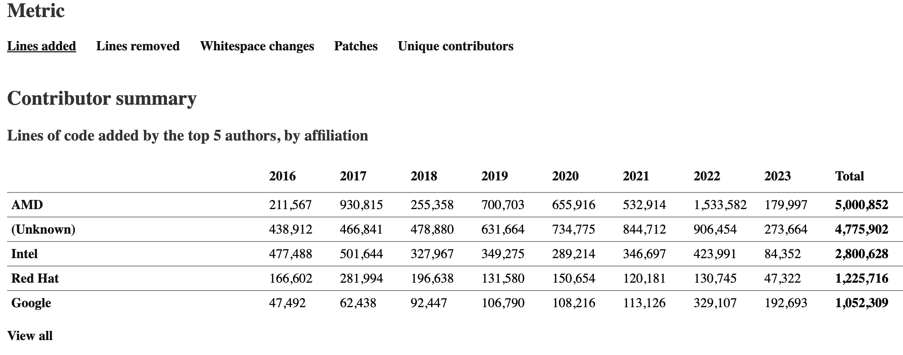

Facade is a program that analyzes the contributors to git repos, organized into
groups called projects, on a commit-by-commit basis.  It is (mostly) managed
using a web interface, and provides some basic data summaries.  For more
advanced analysis, you can export the contributor data as a CSV.  While there is
basic authentication, it's probably best to run it on a private machine.

To get up and running quickly, check out the 
<a href="https://github.com/brianwarner/facade/wiki/Getting-started">Getting
Started</a> guide.

Facade is licensed under Apache 2.0.

### Some tips and tricks

System requirements:
 * Ubuntu 17.10+ or Debian Stretch+
 * Python 3
 * PHP 7.0.18+
 * mysql 5.7.17+

Facade works by cloning a git repo, calculating the parents of HEAD (bounded by
the start date), and scraping each patch for statistics. It calculates lines
added and removed, whitespace changes, patch counts, and unique contributors
over a given period of time. Each time facade-worker.py runs, it recalculates
the parents and trims any commits that have disappeared (for example, if the
start date changes or something was reverted) or that were introduced (new
commits or a freshly-merged branch).

facade-worker.py will not run if it thinks a previous instance is still running.
This could happen when you're doing the initial clone and building of data for
large repos (like the kernel) or if you have a cron job running facade-worker.py
too frequently.  If for some reason facade-worker.py fails and exits early, you
will need to run reset-status.py before it will run again.

Facade is designed to be run frequently as a cron job. This helps ensure that
when you add or change something, it analyzes it quickly. You will set the
interval between repo updates, and it will skip any repos which have been
recently updated. This is to respect the owners of the repos you're analyzing.
The most frequent option is to run every 4 hours, though 24 hours is
recommended.

The command line options for facade-worker.py are documented, and you can run
the various parts of the analysis separately. Use the -h flag to find out what
your options are.

If facade-worker.py is taking forever to run, you should verify that your start
date isn't too early.  Setting this appropriately forward can eliminate a lot of
unnecessary calculations.

If you discover a bunch of (Unknown) affiliations, don't panic. This probably
means you are analyzing a repo with domains that aren't in the stock domain
mappings.  You have a few options here:

1. The easiest way is to enter the affiliation data on the People page. This
causes Facade to rebuild affiliation data for anyone who matches the domain or
email address.

2. The more complicated but faster way is to import config files from gitdm
using the import_gitdm_configs.py script in utilities/

After you do one of the two, you MUST run facade-worker.py at least once for the
changes to be reflected in the web UI.

If you think your affiliation data isn't right, you can always nuke it (yes
really).  Facade looks for any results where the author or committer affiliation
is NULL, and then fills those.  This can trigger very, very long analysis jobs
though, so use it wisely.  Running facade-worker.py -n will do this for you.

If you think your analysis data is corrupt, you can also nuke it (yes really).
Facade will just detect that there is no stored commit data, so it'll rebuild
everything from scratch.  You can do this by deleting all the rows from the
analysis_data table in the database.  The next run will rebuild all of it.

The main reason for tags is to be able to isolate a specific subset of data for
a group of people, for example, your department at work.  Because people and
their email addresses come and go, you just tell Facade the dates between which
a certain email should be tagged, and it'll show up in the output.

Finally, you can choose whether you want statistics on the web UI organized by
author or committer email, and by author or committer date. The default is
author email and committer date, but you can change it up on the configuration
page. You'll need to run facade-worker.py at least once to see the changes.

### I think I found a problem

It's entirely possible. The most likely symptom is that facade-worker.py appears
to run forever. If this happens, you'll need to run utilities/reset-status.py. I
also recommend you set logging to "Debug" and run facade-worker.py at least once
from the terminal. This will give you a lot more info about what went wrong.

Here are a few known situations where Facade doesn't do so well:

1. A git repo requires authentication. facade-worker.py will just wait for a
username and password. I have not yet found a workaround to bypass this, besides
running the script manually.

2. A git pull results in a merge. Again, facade-worker.py will just wait for you
to enter a merge commit message. I have not found a fix for this yet either.

3. Wonky characters and mangled fields in the commit message. Every time I think
I've handled all possible forms of brokenness, someone shows up with an
apostrophe in their email address or some weird unicode character as their @, or
whatever. Please file an issue when you find an unhandled corner case, so I can
address it.

I hope this is helpful to you.  Apologies in advance for inconsistent coding
styles or cumbersome logic.  Contributions and fixes are welcomed!

Brian
